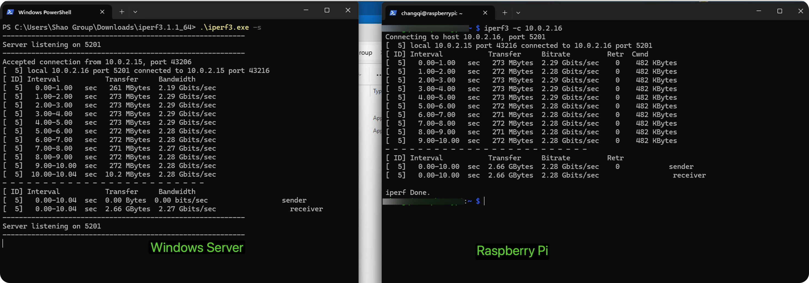
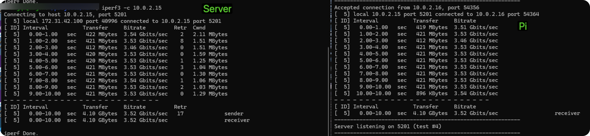
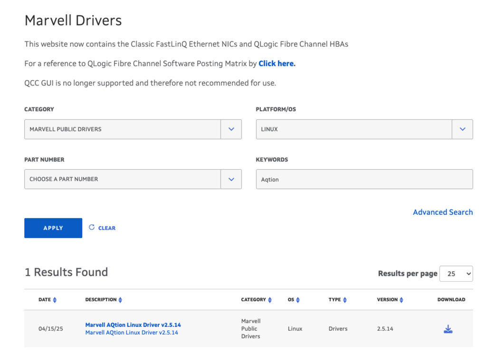
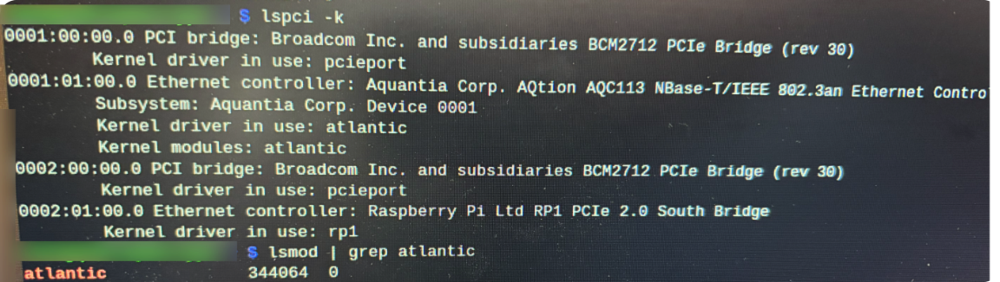

# Increase Ethernet Speed on Raspberry Pi

There are two primary ways to increase the Ethernet speed on a Raspberry Pi beyond the built-in Gigabit port:

1.  **USB 3.0 Adapter** (Easiest, ~2.28 Gbps)
2.  **PCIe Adapter** (Raspberry Pi 5 only, Harder, ~3.45 Gbps)

---

## Option 1: USB 3.0 to 5Gbps Ethernet Adapter

This is the simplest method. You simply need to plug the adapter into a USB 3.0 port.

**Hardware Required:**
-   [5Gbps USB to Ethernet Adapter](https://www.amazon.com/5Gbps-USB-Ethernet-Adapter-Converter/dp/B0FRGG55G7/ref=sr_1_9?crid=4MVR4VFY797A&dib=eyJ2IjoiMSJ9.A_3Ri1GzbRxXuTnVu_pdWj7u8geFk5SKFlI79kH7VQHk1E8EEBwJULgwiWm8w4-i4o8SsJyqzLXDlr1Higa49W_fp7mWGBBiJPaBj65-z_feKvbtFLB6orIZEb-zTeynk7iKdD9npQ2RJF8W1VjmJCG5_fGefkx2mDnY3K8pxi49iLS113E0DCTIysJLw6SGf1g4_lDAtr98JRQQ241Q_5iYwb1uPQGUjxgCaqpAtuo.-YSyPqT_eDto0z_j5EzkLaf-7zXjtDim0-F857VdAWE&dib_tag=se&keywords=usb+3+to+5gbps+ethernet+adapter&qid=1765897971&sprefix=usb+3+to+5gbps+ethernet+adapter%2Caps%2C87&sr=8-9)

**Performance:**
In testing, the bandwidth between the Server and Raspberry Pi reached approximately **2.28 Gbps**.



---

## Option 2: PCIe to 10Gbps Ethernet Adapter (Raspberry Pi 5)

This method utilizes the PCIe interface on the Raspberry Pi 5. It requires more hardware assembly and driver installation.

**Hardware Required:**
-   [IO Crest 10 Gigabit M.2 M Key Ethernet Network Expansion Card](https://www.amazon.com/IO-Gigabit-Ethernet-Network-Expansion/dp/B0BWSLSK78/?th=1)
-   [Official Raspberry Pi M.2 HAT](https://www.amazon.com/Official-Raspberry-Standard-Supports-High-Speed/dp/B0D5CGDJLQ?crid=3T12A6B3TZ7ZA&dib=eyJ2IjoiMSJ9.g8XKmZk49DaSAKSsLsGg_A-YcojVOTUwkF8hYJkr6_FQsbgbotNfM1AaaONp4sSFrRr4LxczXXGS6IOEAC6y6zJvMsmjYA4oxqqR7-5nY-RZfL-M4-NiedDp_BLp4oqpoZMASuJ_UX0v-Y8kJw1k0LY5J08o0t3FrvZzvX7h4z95H3ZYWwhyd2ftAHxCwfE_u4_BUTbzCCHQJcabfbrxSxoH3zBlEyvSTn5lRe4OH7c.vmrpLOGGQJd8eNvbsXLkwst-neC80Ymn1u2v8YNiKhc&dib_tag=se&keywords=Raspberry+Pi+M.2+HAT%2B&qid=1767978896&sprefix=raspberry+pi+m.2+hat%2B%2Caps%2C93&sr=8-1)

**Performance:**
Based on [this reference](https://www.jiribrejcha.net/2024/03/10-gigabit-ethernet-on-raspberry-pi-5/), the maximum expected bandwidth is around **3.45 Gbps**. In our testing, we achieved **3.52 Gbps**.



### Driver Installation
You need to install the driver for the IO Crest card.

1.  **Download the driver**:
    Go to the [Marvell Support Website](https://www.marvell.com/support/downloads.html#).
    Look for the driver matching the card (Aquantia AQtion).
    

2.  **Extract the files**:
    After downloading, unzip the file. You will find files like `Release_Notes...txt`, `README.txt`, and `atlantic.tar.gz`.

3.  **Install Prerequisites**:
    On Debian-based systems (like Raspberry Pi OS):
    ```bash
    sudo apt install linux-headers-$(uname -r) build-essential
    ```
    *(Note: Using `$(uname -r)` ensures you get headers for your current kernel)*

4.  **Build and Install**:
    Follow these steps to compile the driver manually:

    ```bash
    # 1. Create a directory and extract the driver
    mkdir -p ~/aquantia
    cd ~/aquantia
    # Replace the filename with the one you downloaded
    tar zxf Aquantia-AQtion-x.y.z.tar.gz

    # 2. Change to the driver source directory
    # (Replace x.y.z with your actual version number)
    cd Aquantia-AQtion-x.y.z/

    # 3. Compile the driver
    make

    # 4. Unload old driver (if any)
    sudo rmmod atlantic

    # 5. Load the new driver
    sudo make load

    # 6. Install the driver permanently
    sudo make install
    ```
    The driver will be installed to `/lib/modules/$(uname -r)/aquantia/atlantic.ko`.

5.  **Verify Installation**:
    Use the command below to check if the driver is loaded correctly:
    ```bash
    # Check if the module is loaded
    lsmod | grep atlantic
    
    # Or check your network interfaces
    ip link show
    ```
    